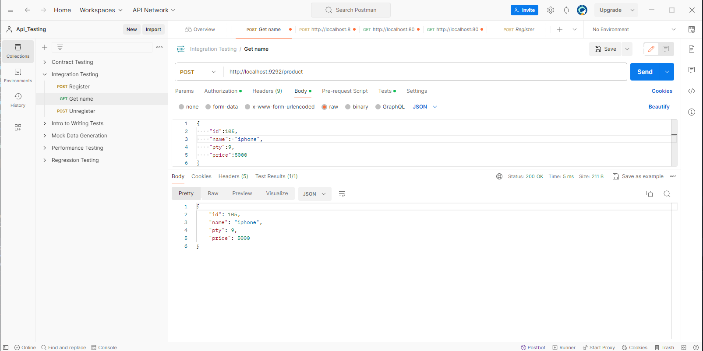
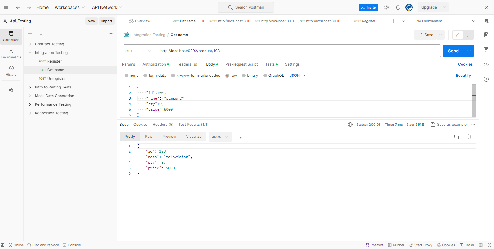
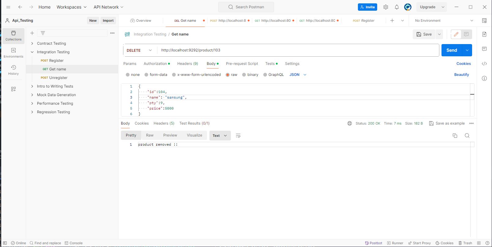

# Spring Data Redis Crud example

1. [x] Post Product:
   

2. [x] Get All Product:
   

3. [x] Get Id Product:
   

4. [x] Delete Id Product:
   

## Dependency
– If you want to use SpringDataRedis:
```xml
<dependency>
   <groupId>org.springframework.boot</groupId>
   <artifactId>spring-boot-starter-data-redis</artifactId>
</dependency>
```
– or Jedis:
```xml
<dependency>
   <groupId>redis.clients</groupId>
   <artifactId>jedis</artifactId>
   <version>5.1.0</version>
</dependency>
```
## Configure Spring Datasource, JPA, App properties
Open `src/main/resources/application.properties`
- For Server port of Redis:
```
server.port=9292